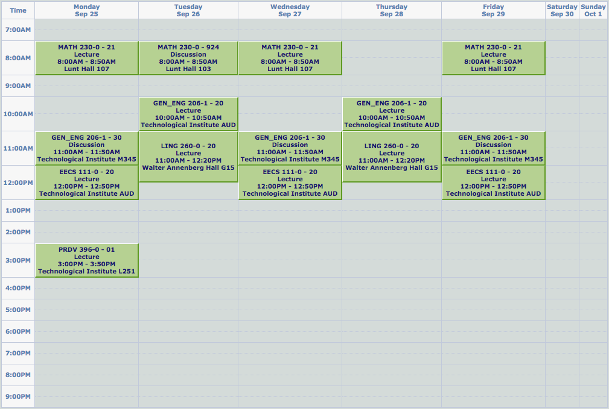

# 2017-2018 Q1

## Classes

Class | Name
--- | ---
EECS 111-0 | [Fundamentals of Computer Programming](./EECS 111-0)
GEN_ENG 206-1 | [Honor Engineering Analysis](./GEN_ENG 206-1)
LING 260-0 | [Formal Analysis of Words & Sentences](./LING 260-0)
MATH 230-0 | [Differential Calculus of Multivariable Functions](./MATH 230-0)
PRDV 396-0 | [Topics in Personal Development](./PRDV 396-0)

## Schedule

___

### Monday

Time | Class | Type | Room | Instructor
--- | --- | --- | --- | ---
8:00AM - 8:50AM | MATH 230-0 - 21 | Lecture | Lunt Hall 107 | Joel Moreira
11:00AM - 11:50AM | GEN_ENG 206-1 - 30 | Discussion | Technological Institute M345 | Ilya Mikhelson, Randall Berry, Randy Freeman
12:00PM - 12:50PM | EECS 111-0 - 20 | Lecture | Technological Institute AUD | Ian Horswill
3:00PM - 3:50PM | PRDV 396-0 - 01 | Lecture | Technological Institute L251 | Renee Salin Probetts

___

### Tuesday

Time | Class | Type | Room | Instructor
--- | --- | --- | --- | ---
8:00AM - 8:50AM | MATH 230-0 - 924 | Discussion | Lunt Hall 103 | Staff
10:00AM - 10:50AM | GEN_ENG 206-1 - 20 | Lecture | Technological Institute AUD | Randall Berry
11:00AM - 12:20PM | LING 260-0 - 20 | Lecture | Walter Annenberg Hall G15 | Masaya Yoshida, Nayoun Kim

___

### Wednesday

Time | Class | Type | Room | Instructor
--- | --- | --- | --- | ---
8:00AM - 8:50AM | MATH 230-0 - 21 | Lecture | Lunt Hall 107 | Joel Moreira
11:00AM - 11:50AM | GEN_ENG 206-1 - 30 | Discussion | Technological Institute M345 | Ilya Mikhelson, Randall Berry, Randy Freeman
12:00PM - 12:50PM | EECS 111-0 - 20 | Lecture | Technological Institute AUD | Ian Horswill

___

### Thursday

Time | Class | Type | Room | Instructor
--- | --- | --- | --- | ---
10:00AM - 10:50AM | GEN_ENG 206-1 - 20 | Lecture | Technological Institute AUD | Randall Berry
11:00AM - 12:20PM | LING 260-0 - 20 | Lecture | Walter Annenberg Hall G15 | Masaya Yoshida, Nayoun Kim

___

### Friday

Time | Class | Type | Room | Instructor
---  | ---   | ---  | ---  | ---
8:00AM - 8:50AM | MATH 230-0 - 21 | Lecture | Lunt Hall 107 | Joel Moreira
11:00AM - 11:50AM | GEN_ENG 206-1 - 30 | Discussion | Technological Institute M345 | Ilya Mikhelson, Randall Berry, Randy Freeman
12:00PM - 12:50PM | EECS 111-0 - 20 | Lecture | Technological Institute AUD | Ian Horswill

___
